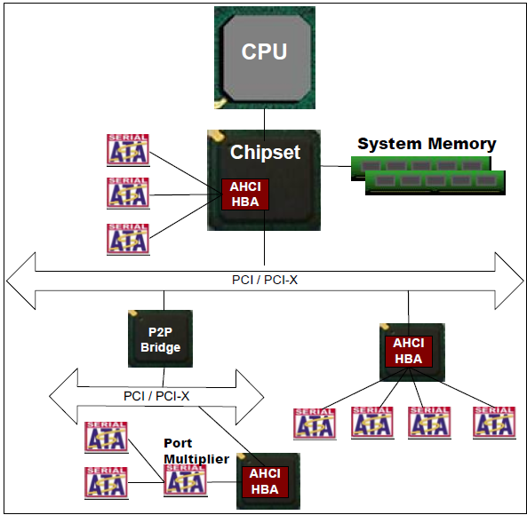
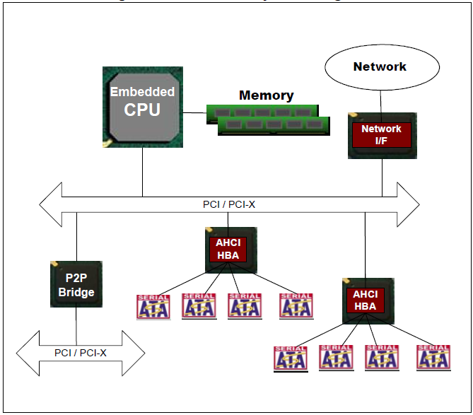

.. _ch1:

1 介绍
==========

.. toctree::
   :maxdepth: 2 

1.1 概述
-----------

这个规范规定了高级主机控制器接口（Advanced Host Controller Interface，AHCI）的功能行为（functional behavior）和软件接口。AHCI 是允许软件与 `SATA <http://zh.wikipedia.org/wiki/SATA>`_ （Serial ATA，串行ATA，以后简称 SATA）存储设备交流信息的硬件机制。AHCI 是一个 PCI 类的设备，作为系统内存和 SATA 设备之间的数据移动引擎（data movement engine）。

AHCI 主机设备（又称为主机总线适配器 host bus adapters，或者 HBA）支持 1 到 32 端口。一个 HBA 必须支持 `ATA <http://zh.wikipedia.org/wiki/ATA>`_ 和 `ATAPI <http://baike.baidu.com/view/25986.htm>`_ 设备，还有必须支持 `PIO <https://zh.wikipedia.org/wiki/PIO>`_ 和 `DMA <https://zh.wikipedia.org/wiki/DMA>`_ 协议。一个 HBA 可以选择性地支持一个命令列表，关于每个用于减少开销的端口；还要支持 SATA 原生指令排序，通过用于每个最多 32 个入口的设备的 FPDMA（First Party DMA）排序命令协议。一个 HBA 可以选择性地支持 64 位寻址。

AHCI 描述了一个系统内存结构，它包含了一个用于控制和状态的通用区域，和一个存放描述命令列表条目的表（an HBA which does not support a command list shall have a depth of one for this table）。每个命令列表条目包含必要的信息来编写 SATA 设备的程序，和一个指针，指向用于在系统内存和设备之间传递数据的描述符表。

1.2 范围 （Scope）
---------------------

AHCI 包括一个 PCI 设备。它包含一个 PCI BAR（Base Address Register，基地址寄存器），用于实现原生 SATA 特性。AHCI 规定了以下特性：

* 支持 32个端口 （Support for 32 ports）
* 消除 主 / 从 操作 （Elimination of Master / Slave Handling）
* 热插拔 （Hot Plug）
* 硬件辅助原生指令排序 （HW Assisted Native Command Queuing）
* 冷设备存在检测（Cold device presence detect）
* 活动 LED 生成（Activity LED generation）
* 64 位寻址 （64-bit addressing）
* 支持大型逻辑区块地址 （Large LBA support，PS：Logical Block Address, LBA）
* 功耗管理 （Power Management）
* 交错启动 （Staggered Spin-up）
* SATA 超集寄存器（Serial ATA superset registers）
* 端口多路器 （Port Multiplier）

1.3 范围之外 （Outside of Scope）
-------------------------------------

SATA 的 传输层、链路层或者物理层的实现，AHCI 不会包含与这些相关的信息。因为这个在 SATA 1.0a 规范里有全面的描述。

AHCI 不会规定 ATA 遗留下来的特性，例如遗留的 I/O 范围，或者 IDE 总线主控。AHCI 已经做了限额（Allowances），因此一个 HBA 可以实现这些向后兼容旧操作系统的特性（例如，用于 AHCI的内存条（BAR）的位置在用于原生 IDE 和 总线主控 IDE 两者的位置之后）。

1.4 框图 （Block Diagram）
----------------------------

插图 1，几个 AHCI HBA 被附加在一个典型的计算机系统里。一个 HBA 被集成在核心芯片上。另一个位于第一个可用的 PCI/PCI-X 总线旁（PCI 是引用名称。可以是任何 PCI 类的总线，例如 PCI-X、PCI-Express、HyperTransport 等等）。目的是要符合 PCI 基础规范。符合非 PCI 规范依赖这些被 PCI 兼容或者兼容 PCI 的规范。

最后一个 HBA 位于第二个在 PCI-PCI 桥后面的 PCI 总线旁。这个最后的 HBA 有一个附加在端口多路器的端口。

插图 1：英特尔架构的基础系统框图

插图 2：两个 HBA 与一个自带有本地内存（local memory）的嵌入式 CPU 相连。这个配置最有可能被用在 RAID 类型的环境中。

1.5 惯例 （Conventions）
------------------------

硬件必须为所有标记为保留（reserved）的位（bits）和寄存器（registers）返回 0 ，软件必须给所有保留的位和寄存器写入 0 值。

在寄存器章节里面，用到下面的缩写：

* **RO** : Read Only 只读
* **RW** : Read Write 只写
* **RWC** : Read/Write ‘1’ to clear 
* **RW1** : Read/Write ‘1’ to set
* **Impl. Spec.** : Implementation Specific – the HBA has the freedom to choose its implementation.特定实现 —— HBA 可以自由选择自己的实现
* **HwInit** : The default state is dependent on device and system configuration.The value is initialized at reset, either by an expansion ROM, or in the case of integrated devices, by a platform BIOS.默认的状态取决于设备和系统的配置。在复位的时候初始化值，要么是通过一个扩展的 ROM，要么是在继承设备的情况下通过 BIOS 平台。

当这个文档提到位寄存器（register bit），约定是指“寄存器符号（Register Symbol），字段符号（Field Symbol）”。例如，

  
